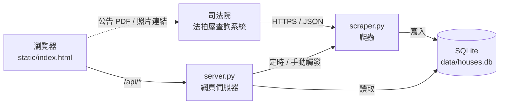
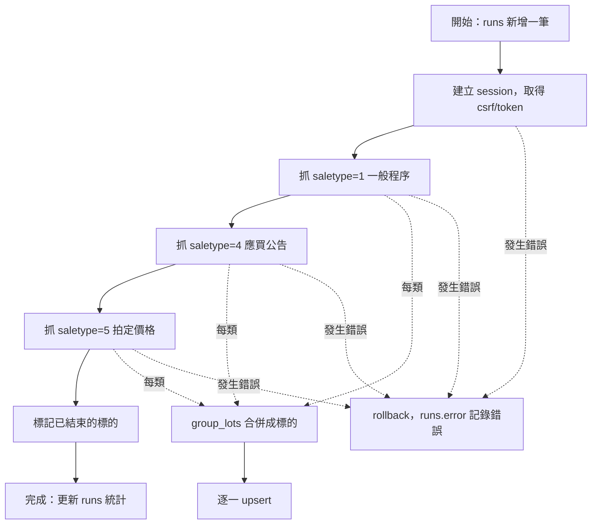

# 台北法拍屋追蹤系統 — 系統說明文件

版本：1.0　最後更新：2026-10-02

---

## 目錄

1. [系統概述](#1-系統概述)
2. [系統架構](#2-系統架構)
3. [資料來源](#3-資料來源)
4. [資料處理流程](#4-資料處理流程)
5. [資料庫設計](#5-資料庫設計)
6. [網頁伺服器與 API](#6-網頁伺服器與-api)
7. [網頁儀表板](#7-網頁儀表板)
8. [安裝與操作](#8-安裝與操作)
9. [維運](#9-維運)
10. [疑難排解](#10-疑難排解)
11. [已知限制](#11-已知限制)
12. [擴充方向](#12-擴充方向)

---

## 1. 系統概述

### 1.1 目的

自動蒐集**臺北市**法院拍賣房屋（法拍屋）資訊，集中顯示並長期追蹤每個標的的：

- 拍賣狀態（拍賣中、應買公告、停拍、已拍定、已結束）
- 每一拍的底價變化（一拍 → 二拍 → 三拍的降幅）
- 拍定成交價與溢價率

### 1.2 功能一覽

| 功能 | 說明 |
|---|---|
| 自動抓取 | 定時從司法院法拍屋查詢系統抓取臺北市房屋拍賣資料（預設每 6 小時） |
| 手動更新 | 網頁上的「立即更新」按鈕 |
| 歷程追蹤 | 每一拍的底價、拍定價都保留，可看降價幅度 |
| 篩選與排序 | 行政區、拍次、點交、權利範圍、底價上限、關鍵字、新上架、停拍 |
| 統計 | 拍賣中件數、近 7 天新上架、14 天內開拍、底價中位數單價、各區件數圖 |
| 外部連結 | 法院拍賣公告 PDF、現場照片、Google 地圖 |

### 1.3 技術選型

| 項目 | 選擇 | 原因 |
|---|---|---|
| 語言 | Python 3.9+（只用標準函式庫） | 不需安裝套件，部署簡單 |
| 資料庫 | SQLite（`data/houses.db`） | 單一檔案、免安裝，適合單人使用 |
| 網頁伺服器 | Python `http.server`（`ThreadingHTTPServer`） | 內建、足夠本機使用 |
| 前端 | 單一 HTML 檔（原生 JavaScript、內嵌 SVG 圖表） | 無建置流程、無外部相依 |

---

## 2. 系統架構



### 2.1 檔案結構

```
houses/
├── scraper.py          爬蟲：連線、抓取、整理、寫入資料庫
├── server.py           網頁伺服器：API、靜態檔案、排程
├── static/
│   └── index.html      儀表板前端
├── data/
│   └── houses.db       SQLite 資料庫（執行後自動產生）
├── docs/
│   └── 系統說明.md     本文件
└── README.md           快速開始
```

### 2.2 元件職責

| 元件 | 主要函式 / 類別 | 職責 |
|---|---|---|
| `scraper.py` | `JudicialClient` | 管理 session、CSRF、token，呼叫查詢 API 並分頁 |
| | `group_lots()` | 將多筆建物資料合併為「標的」 |
| | `upsert()` | 新增或更新標的，寫入拍賣歷程 |
| | `run()` | 一次完整抓取流程，並記錄執行結果 |
| `server.py` | `Handler` | 提供 API 與靜態網頁 |
| | `scheduler()` | 背景執行緒，依間隔自動抓取 |
| | `do_scrape()` | 以鎖確保同一時間只跑一個抓取 |

---

## 3. 資料來源

### 3.1 來源網站

司法院「法拍屋查詢系統」：<https://aomp109.judicial.gov.tw/judbp/wkw/WHD1A02.htm>

臺北市的房屋拍賣由兩個法院辦理：

| 法院代碼 | 法院 | 轄區 |
|---|---|---|
| `TPD` | 臺灣臺北地方法院 | 中正、大同、中山、松山、大安、萬華、信義、文山、南港 |
| `SLD` | 臺灣士林地方法院 | 士林、北投、內湖 |

系統以「縣市 = 臺北市」查詢，不以法院查詢，因此兩個法院的資料都會涵蓋。

### 3.2 連線流程

查詢 API 有防護機制，必須照順序完成：

1. `GET /judbp/wkw/WHD1A02.htm`：取得 session cookie
2. `GET /judbp/wkw/WHD1A02/V2.htm`：從頁面中解析 `_csrf` 與 `token`
3. `POST /judbp/wkw/WHD1A02/QUERY.htm`：送出查詢，必須帶：
   - Header `Referer: .../WHD1A02/V2.htm`（缺少會回「不合法的查詢」）
   - Header `X-Requested-With: XMLHttpRequest`
   - 表單欄位 `_csrf`、`token`

同一個 session 的 token 可重複使用於多次查詢與分頁。

### 3.3 查詢參數

| 參數 | 本系統使用的值 | 說明 |
|---|---|---|
| `county` | `A` | 縣市代碼，`A` = 臺北市 |
| `proptype` | `C52` | 拍賣標的：`C52` 房屋、`C51` 土地、`C103` 房屋+土地、`C54` 動產 |
| `saletype` | `1`、`4`、`5` | `1` 一般程序、`4` 應買公告、`5` 拍定價格 |
| `pageSize` | `200` | 每頁筆數 |
| `pageNum` | 1, 2, … | 依回傳的 `pageInfo.totalNum` 分頁直到抓完 |
| `sorted_column` | `A.CRMYY, A.CRMID, A.CRMNO, A.SALENO, A.ROWID` | 依案號排序 |

### 3.4 回傳的主要欄位

API 回傳 JSON，`data` 為陣列，每一筆是一個建物（不是一個標的）：

| 欄位 | 意義 | 範例 |
|---|---|---|
| `crtid` / `crtnm` | 法院代碼 / 名稱 | `TPD` / 臺灣臺北地方法院 |
| `crmyy` `crmid` `crmno` | 案號（年、字、號） | `111` `司執` `016918` |
| `crm` | 完整案號 | 111司執字第016918號 |
| `dpt` | 股別 | 佳 |
| `batchno` | 標別 | 5 |
| `saledate` | 拍賣日（民國，7 碼） | `1151012` = 2026-10-12 |
| `saleno` / `salenostr` | 拍次 | `1` / 第1拍 |
| `hsimun` `ctmd` `sec` | 縣市、行政區、段 | 臺北市、信義區、雅祥 |
| `budadd` | 建物門牌（有時不含縣市區） | 基隆路一段143號7樓之3 |
| `btotal` | 建物面積（平方公尺） | 87.13 |
| `rrange` | 權利範圍 | 全部、6分之1 |
| `summinprc` | 該標別總拍賣底價（元） | 2600000 |
| `minprice` | 該建物底價（元） | 1900000 |
| `sumprice` | 拍定總價（僅 `saletype=5`） | 33520000 |
| `checkyn` | 點交：`Y` 點交、`N` 不點交、`M` 如備註 | N |
| `emptyyn` | 空屋 | Y 或空白 |
| `comm_yn` | 是否可通訊投標 | N |
| `rmk` / `rmkexcel` | 備註（如停拍公告） | 停拍公告 |
| `filenm` | 拍賣公告 PDF 路徑 | /tpd/11504/02090916778.046.pdf |
| `para` / `pic_cnt` | 照片頁參數 / 照片數 | — / 22 |

### 3.5 外部連結

| 用途 | 網址格式 |
|---|---|
| 拍賣公告 PDF | `https://aomp109.judicial.gov.tw/judbp/wkw/WHD1A02/DO_VIEWPDF.htm?filenm={filenm}` |
| 現場照片 | `https://kpic.judicial.gov.tw/judkp/wkw/WHD1A02_DETAIL.htm?para={para}` |
| 地圖 | `https://www.google.com/maps/search/{地址}` |

---

## 4. 資料處理流程

### 4.1 一次抓取（`scraper.run()`）



- 三類依 1 → 4 → 5 的順序處理，讓「拍定」最後寫入、覆蓋拍賣中狀態。
- 分頁之間、類別之間各暫停 1 秒，避免對官方網站造成負擔。
- 整次抓取在同一個交易內，失敗時全部回復，不會留下一半的資料。

### 4.2 合併為「標的」（`group_lots()`）

一個拍賣標的常包含多筆建物（例如主建物＋未登記增建），API 每筆建物一列。系統將以下欄位相同的列合併為一個標的：

```
法院 + 案號（年、字、號）+ 標別 + 拍賣日
```

合併後：

- **地址**：所有建物門牌去重排序；門牌若不含「臺北市XX區」會自動補上。
- **面積**：以「地址＋面積」去重後加總（同一建物搭配不同土地地號時會重複出現，不重複計算）。
- **權利範圍**：任一建物不是「全部」，就標為「持分」。
- **底價**：使用 `summinprc`（整個標別的總底價，含土地）。

### 4.3 標的識別碼（`lot_key`）

同一個標的在不同拍次之間要能對應起來，才能追蹤降價。識別碼為：

```
lot_key = SHA1( 法院 | 案號 | 排序後的地址清單 ) 的前 16 碼
```

不使用標別與拍賣日，因為兩者在不同拍次之間會改變。

### 4.4 寫入規則（`upsert()`）

| 情況 | 處理方式 |
|---|---|
| 新標的 | 新增至 `lots`，`first_price` 記為當次底價，`first_seen` 記為抓取時間 |
| 拍定資料（saletype=5） | 只更新 `status=sold`、`sold_price`、`sold_date`，保留原拍賣資訊 |
| 已拍定，或抓到的是較舊拍次 | 只更新 `last_seen` |
| 拍賣中資料有變動 | 更新所有欄位；狀態、拍次、拍賣日、底價、備註有變時更新 `updated_at` 並計為「異動」 |
| 每一次 | 在 `rounds` 新增或更新一筆（以 標的 + 類別 + 日期 為主鍵） |

### 4.5 狀態判斷

| 狀態 | 代碼 | 判斷條件 |
|---|---|---|
| 拍賣中 | `active` | 出現在一般程序，且無停拍備註 |
| 應買公告 | `special` | 出現在應買公告（特別程序） |
| 停拍 | `stopped` | 備註有內容且不是「更正」（例如停拍公告） |
| 已拍定 | `sold` | 出現在拍定價格 |
| 已結束 | `ended` | 原本是 active / special / stopped，拍賣日已過，且這次沒有再出現 |

`ended` 代表流標後尚未再公告、撤回或其他原因，系統無法區分。如果之後又出現下一拍，狀態會自動回到 `active`。

### 4.6 日期轉換

民國 7 碼日期轉西元：`1151012` → 年 `115 + 1911 = 2026`、月 `10`、日 `12` → `2026-10-12`。

---

## 5. 資料庫設計

資料庫檔案：`data/houses.db`（SQLite）。第一次執行時自動建立。

### 5.1 `lots` — 標的（每個標的一筆，存最新狀態）

| 欄位 | 型態 | 說明 |
|---|---|---|
| `lot_key` | TEXT PK | 標的識別碼（見 4.3） |
| `crtid` / `crtnm` | TEXT | 法院代碼 / 名稱 |
| `crm` / `dpt` | TEXT | 案號 / 股別 |
| `district` / `sec` | TEXT | 行政區 / 段 |
| `addresses` | TEXT | 地址清單（JSON 陣列） |
| `area_m2` | REAL | 建物面積合計（平方公尺） |
| `rrange` | TEXT | `全部` 或 `持分` |
| `checkyn` | TEXT | `點交` / `不點交` / `如備註` |
| `emptyyn` | TEXT | `空屋` 或空白 |
| `comm_yn` | TEXT | 通訊投標 `Y` / `N` |
| `status` | TEXT | 見 4.5 |
| `saletype` | TEXT | 最後一次資料的類別 `1` / `4` / `5` |
| `saleno` / `salenostr` | TEXT | 拍次 / 拍次文字 |
| `saledate` | TEXT | 最近一次拍賣日（ISO 格式） |
| `min_price` | INTEGER | 最近一次總底價（元） |
| `first_price` | INTEGER | 首次追蹤到的總底價（元） |
| `sold_price` / `sold_date` | INTEGER / TEXT | 拍定價（元）/ 拍定日 |
| `rmk` | TEXT | 備註 |
| `filenm` | TEXT | 公告 PDF 路徑 |
| `para` / `pic_cnt` | TEXT / INTEGER | 照片參數 / 照片數 |
| `first_seen` | TEXT | 首次抓到時間 |
| `last_seen` | TEXT | 最後一次抓到時間 |
| `updated_at` | TEXT | 最後一次內容異動時間 |

索引：`idx_lots_status (status)`

### 5.2 `rounds` — 拍賣歷程（每個標的每一拍一筆）

| 欄位 | 型態 | 說明 |
|---|---|---|
| `lot_key` | TEXT | 對應 `lots.lot_key` |
| `saletype` | TEXT | `1` / `4` / `5` |
| `saledate` | TEXT | 拍賣日或拍定日 |
| `saleno` / `salenostr` | TEXT | 拍次 |
| `min_price` | INTEGER | 該拍總底價（元） |
| `sold_price` | INTEGER | 拍定價（元，僅拍定） |
| `rmk` | TEXT | 備註 |
| `filenm` | TEXT | 該拍公告 PDF |
| `first_seen` | TEXT | 首次抓到時間 |

主鍵：`(lot_key, saletype, saledate)`

### 5.3 `runs` — 執行紀錄（每次抓取一筆）

| 欄位 | 型態 | 說明 |
|---|---|---|
| `id` | INTEGER PK | 自動編號 |
| `started` / `finished` | TEXT | 開始 / 結束時間 |
| `n_rows` | INTEGER | 抓到的建物筆數 |
| `n_lots` | INTEGER | 合併後的標的數 |
| `n_new` | INTEGER | 新增標的數 |
| `n_changed` | INTEGER | 異動標的數 |
| `error` | TEXT | 錯誤訊息（成功為 NULL） |

### 5.4 常用查詢

```sql
-- 拍賣中且點交、權利全部的標的，依拍賣日排序
SELECT district, addresses, min_price, saledate, salenostr
FROM lots
WHERE status = 'active' AND checkyn = '點交' AND rrange = '全部'
ORDER BY saledate;

-- 降價最多的標的
SELECT addresses, first_price, min_price,
       ROUND(100.0 * (first_price - min_price) / first_price, 1) AS drop_pct
FROM lots
WHERE status = 'active' AND min_price < first_price
ORDER BY drop_pct DESC;

-- 某標的完整歷程
SELECT * FROM rounds WHERE lot_key = '...' ORDER BY saledate;

-- 最近 10 次執行結果
SELECT * FROM runs ORDER BY id DESC LIMIT 10;
```

---

## 6. 網頁伺服器與 API

伺服器：`server.py`，預設 `http://127.0.0.1:8000`。

### 6.1 啟動參數

| 參數 | 預設 | 說明 |
|---|---|---|
| `--port` | `8000` | 連接埠 |
| `--host` | `127.0.0.1` | 綁定位址；改成 `0.0.0.0` 可讓區網其他裝置連線 |
| `--interval` | `6` | 自動更新間隔（小時）；`0` 表示關閉。啟動時會立即抓一次 |

### 6.2 API

| 方法 | 路徑 | 說明 | 回傳 |
|---|---|---|---|
| GET | `/api/lots` | 所有標的 | `{ lots: [...], pdf_url, pic_url }`，`addresses` 已轉為陣列 |
| GET | `/api/history?key={lot_key}` | 單一標的的拍賣歷程 | `rounds` 陣列，依日期排序 |
| GET | `/api/status` | 更新狀態 | `{ last_run, last_success, running }` |
| POST | `/api/refresh` | 立即抓取 | 成功：`{ new, changed, lots }`；失敗或已在執行：`{ error }` |
| GET | `/` 及其他 | 靜態檔案（`static/`） | — |

`POST /api/refresh` 會等抓取完成才回應，通常需要 10～20 秒。同一時間只允許一個抓取執行，第二個請求會收到 `{"error": "已在更新中"}`。

---

## 7. 網頁儀表板

檔案：`static/index.html`。必須透過伺服器開啟（`http://localhost:8000`），直接開啟 HTML 檔案無法取得資料，頁面會顯示紅字提示。

### 7.1 畫面區塊

| 區塊 | 內容 |
|---|---|
| 頂部 | 最後更新時間、「立即更新」按鈕 |
| 統計卡片 | 拍賣中標的（含一般程序 / 應買公告分項）、近 7 天新上架、14 天內開拍、底價中位數單價 |
| 長條圖 | 各行政區拍賣中標的數；滑鼠移上顯示數量，點擊可篩選該區 |
| 分頁 | 拍賣中、應買公告、已拍定、已結束 / 撤回、全部 |
| 篩選列 | 關鍵字、行政區、拍次、點交、權利、底價上限（萬元）、只看新上架、含停拍 |
| 表格 | 點欄位標題排序；點任一列展開拍賣歷程與標的資訊 |

### 7.2 表格欄位計算方式

| 欄位 | 計算 |
|---|---|
| 總底價（萬） | `min_price / 10000` |
| 拍定價（萬） | `sold_price / 10000` |
| 溢價 | `sold_price / min_price − 1` |
| 較首拍 | `1 − min_price / first_price`（有降價才顯示） |
| 坪數 | `area_m2 × 0.3025` |
| 單價（萬/坪） | `總底價 ÷ 坪數`，**僅權利範圍「全部」的標的計算** |
| 新（標籤） | `first_seen` 在 7 天內；系統第一次執行時不顯示 |

### 7.3 自動重新整理

頁面每 5 分鐘自動重新讀取資料（只讀資料庫，不會觸發抓取）。

---

## 8. 安裝與操作

### 8.1 環境需求

- Python 3.9 以上（已在 3.14 測試）
- 可連線至 `judicial.gov.tw`
- 不需安裝任何套件

### 8.2 啟動

```bash
cd /home/tunyuan/houses
python3 server.py
```

開啟瀏覽器進入 <http://localhost:8000>。終端機視窗需保持開啟。

### 8.3 只抓資料（不開網頁）

```bash
python3 scraper.py
```

輸出範例：

```
[一般程序] 269 筆建物 → 152 個標的
[應買公告] 27 筆建物 → 15 個標的
[拍定] 120 筆建物 → 66 個標的
完成：新增 0，異動 0
```

### 8.4 用 cron 排程

若不想讓伺服器一直執行，可改用 cron 定時抓取，需要看資料時再啟動伺服器（`--interval 0`）：

```
0 */2 * * * cd /home/tunyuan/houses && /usr/bin/python3 scraper.py >> data/scrape.log 2>&1
```

> WSL 環境預設不會自動啟動 cron，需先執行 `sudo service cron start`，或在 `/etc/wsl.conf` 設定開機啟動。

---

## 9. 維運

### 9.1 確認系統是否正常

- 網頁頂部的「最後更新」時間是否在預期間隔內
- 若顯示「最近一次更新失敗」，查詢錯誤原因：

```sql
SELECT started, error FROM runs WHERE error IS NOT NULL ORDER BY id DESC LIMIT 5;
```

### 9.2 備份

資料庫是單一檔案，複製即可備份（建議在沒有抓取執行時進行）：

```bash
cp data/houses.db "data/houses-$(date +%Y%m%d).db"
```

追蹤歷程只存在本機資料庫，**刪除資料庫會失去所有歷史紀錄**（法院網站不保留過去的拍次）。

### 9.3 重新開始

刪除 `data/houses.db` 後重新執行，即會重建空白資料庫。

### 9.4 抓取頻率

法院公告通常在上班時間上架，每 2～6 小時抓一次已足夠。請勿設定過於頻繁，以免對官方網站造成負擔或被封鎖。

---

## 10. 疑難排解

| 症狀 | 原因 | 處理 |
|---|---|---|
| 頁面顯示「無法連線到伺服器」 | 沒有執行 `server.py`，或直接開啟了 HTML 檔 | 執行 `python3 server.py`，用 `http://localhost:8000` 開啟 |
| 按「立即更新」沒有反應 | 同上 | 同上 |
| `CERTIFICATE_VERIFY_FAILED: Missing Subject Key Identifier` | 司法院憑證缺少 SKI 擴充欄位，Python 3.13+ 嚴格模式拒絕 | 程式已關閉 `VERIFY_X509_STRICT`（仍驗證憑證）；若仍出現，確認使用的是最新版 `scraper.py` |
| `查詢失敗: 不合法的查詢` | 缺少 Referer、session 過期，或網站改版 | 確認 `JudicialClient.query()` 有帶 Referer；若網站改版需更新程式 |
| `Address already in use` | 連接埠已被占用（可能已有一個伺服器在執行） | 換連接埠 `--port 8080`，或關閉原本的程式 |
| 更新完成但「新增 0、異動 0」 | 法院這段期間沒有新公告 | 正常現象 |
| 抓取逾時 | 法院網站緩慢或維護中（常見於晚間或週末） | 稍後再試；查看網站是否公告停機維護 |

---

## 11. 已知限制

1. **範圍**：只抓臺北市的「房屋」（`C52`），不含純土地、動產，也不含行政執行署或臺灣金服的拍賣。
2. **歷程從開始執行才累積**：系統啟用前的拍次無法回溯；第一次執行時抓到的拍定資料，大多無法對應到拍賣中的標的。
3. **標的對應**：以「法院＋案號＋地址」識別。若法院在不同拍次登錄的地址寫法不同，會被當成不同標的。
4. **面積**：只計算建物登記面積（含未登記部分），不含土地持分，也不區分主建物與公設。
5. **單價**：持分標的不計算單價；底價包含土地價值，因此單價與市場行情的「建坪單價」意義不完全相同。
6. **已結束（ended）**：無法區分流標、撤回或延期。
7. **點交、占用、增建等細節**只存在公告 PDF 中，系統未解析，投標前務必閱讀原始公告。
8. **單人使用**：SQLite 與內建伺服器適合本機，不適合多人同時存取或公開部署。
9. **網站改版風險**：依賴司法院網站的內部 API，若網站改版，爬蟲可能需要修改。

---

## 12. 擴充方向

| 項目 | 做法 |
|---|---|
| 其他縣市 | `python3 scraper.py --county <代碼>`；代碼可由 `QUERY_COUNTY.htm` 取得（例如 `1` 新北市、`C` 基隆市、`H` 桃園市） |
| 新物件 / 降價通知 | 在 `run()` 結束時，針對 `n_new`、`n_changed` 的標的透過 LINE Messaging API、Telegram 或 Email 發送通知 |
| 土地 / 房屋+土地 | 將 `proptype` 改為 `C51` 或 `C103` |
| 其他來源 | 行政執行署、臺灣金融資產服務公司的拍賣公告 |
| 解析公告 PDF | 擷取使用情形、占用、增建、保證金等欄位 |
| 實價登錄比對 | 以地址或段名比對內政部實價登錄，估算折價率 |
| 雲端部署 | 改用 PostgreSQL＋正式 Web 框架，部署到雲端主機持續執行 |
